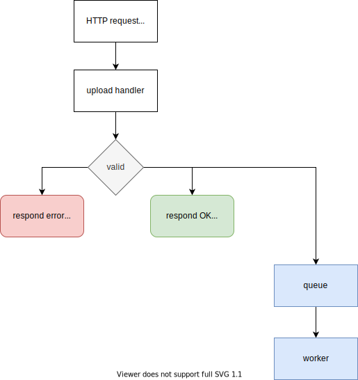

# Shrinker

Shrinker is a web api using a message queue in order to offload heavy computing tasks (namely image processing) to a worker.

## Running the project

```sh
# server
go run ./cmd/server/main.go

# worker
go run ./cmd/worker/main.go
```

## Infrastructure


## Control flow

### Upload an avatar



A user makes a request to the API to upload their avatar:

```txt
POST /api/v1/users/{id}/avatar

request body: <file>
```

The API validates the request and the file extension.

If the request is valid, the API forwards the task to the worker through the message queue.

### Save uploaded avatar


On completion of the job, the worker makes a second request to the API to write in the database the updates relative to the newly stored image.

```txt
PATCH /api/v1/users/{id}

request body: {"avatar_url": "path/to/file", "user_id": 1}
authorization headers: APIKEY
```

The API then updates the corresponding user and updates or creates the avatar entry in the database.

## Project structure

The main functional packages are structured this way:

```txt
.
├── cmd
│   ├── server
│   └── worker
├── internal
│   ├── database
│   ├── http
│   └── storage
└── pkg
    ├── queue
    └── image
```

`internal` package holds the definitions of the business entities at its root.
