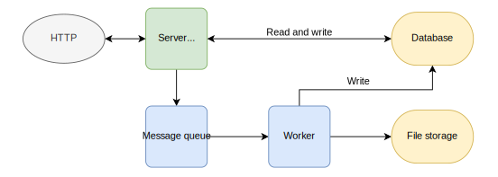
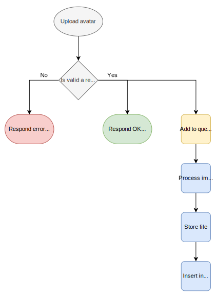

# Shrinker

Shrinker is a web API using a message broker in order to offload heavy computing tasks (namely image processing) to a worker.

## Getting started

### Installing dependencies

```sh
go get -u
```

> Note: Go version 1.15 minimum is required.

### Set up

> Note: you must be able to run Docker and Docker Compose on your local machine to run this app. Refer to the [Get Docker](https://docs.docker.com/get-docker/) and [Install Docker Compose](https://docs.docker.com/compose/install/) docs for their installation.

You must provide a `.env` file inside the root directory.
For a quick start, you can use the values from the provided example:

```sh
echo "$(cat .env.example)" >> .env
```

Set up and run the MySQL docker instance:

```sh
make docker
```

Once the instance is ready, run the executable with `-m` flag to perform mock migrations:

```sh
go run cmd/server/main.go -m
```

<!-- Message queue docker set up here -->

<!-- Static server does not need any particular set up -->

### Run the project

This project uses 3 executables and one instance of a message queue. You need to run them all at the same time.

#### API server (and MySQL instance)

```sh
# alias to make docker && go run cmd/server/main.go
make start
```

#### Static file server

```sh
go run ./cmd/static/*.go
# or to bullet proof against any future test file:
go run $(ls -1 ./cmd/static/*.go | grep -v _test.go)
```

#### Message queue

```sh
docker run -it --rm --name rabbitmq -p 5672:5672 -p 15672:15672 rabbitmq:3-management
```

#### Worker

```sh
go run ./cmd/worker/main.go
```

## Infrastructure



The 3 main applicative entities are the API server, the worker and the message broker:

- the API simply interacts with the message broker and the database based on a client request
- the message broker is in charge of asking the worker to start its job
- the worker makes resquests to store files and can write in the database

## Control flow

The main work flow of this project is the request for a user to upload an avatar.

```txt
POST /api/v1/users/{ID}/avatar

content type: multipart/form-data
body: <image_file>
```



## Architecture

### Folder structure

The main functional packages for the project are:

```txt
.
├── cmd
│   ├── server
│   ├── static
│   └── worker
├── internal
│   ├── database
│   └── http
└── pkg
    ├── queue
    └── image
```

### `internal`

The main application code, it can be viewed as private. Domain related type definitions are at its root and packages within are grouped by dependencies (database, http, etc.).

### `pkg`

Reusable library code. It is safe to use by external applications. It does not import any types from `internal` and does not rely on it to work. No domain logic spills out in package inside this directory.

### `cmd`

Main applications for this project. Each direcory inside are equivalent to one executable and are independant from one another. A `main` function may need to import and call code from `internal` or `pkg`. If so, it will ties all dependencies together.

### Miscellaneous

Other directories are self explanatory.

Also, sub-packages have their own documentation when relevant that you may refer to for further explanation. Notably:

- [http](internal/http/README.md) (comes with handy curl commands)
- [database](internal/database/README.md)
- [static](cmd/static/README.md)
- [queue](pkg/queue/README.md)
